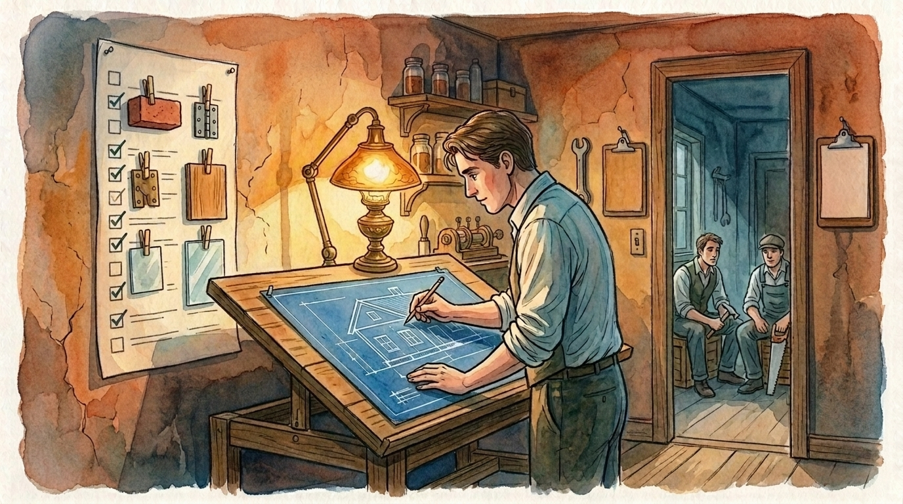

# Claude Workforce

*A skill tells an AI what to do. An employee knows what to do, refuses to do anything else, and can prove it did the job.*

You use one AI assistant for everything. It writes the copy, debugs the build, reviews the design. It does all of it, and none of it well enough. You've probably noticed already: you switch models in the middle of a session without thinking about it, because the coder can't write and the writer can't debug.

Claude Workforce turns that instinct into a company. One command reads your project, picks the right model for each kind of work, writes a handbook for every role, and gives you a team you talk to instead of a single assistant. Each employee follows a scope it won't leave, runs on the model built for its job, and proves its work with a check that actually passes or fails. Not "looks good." Passes or fails.

> **Supersedes** [claude-enforcer](https://github.com/odysseyalive/claude-enforcer). If you run the enforcer today, [here's the migration path](COMMANDS.md).

> **PAIRS WELL WITH:** [playwright-mcp](https://github.com/odysseyalive/playwright-mcp). Web-facing employees are the hardest to hire, because clicking around a page rarely leaves behind a clean pass-or-fail signal the way finished code does. This tool records you logging into a site once, then turns that recording into a repeatable test the employee can run, so the proof is a test that passes, not a model's say-so. It also handles fetching web pages, which these employees otherwise can't do on their own.

> [!TIP]
> 😎 **If Claude Workforce is part of your workflow, [give it a star](https://github.com/odysseyalive/claude-workforce).** It helps other people find the project.
> 
> [](https://github.com/odysseyalive/claude-workforce)


## Contents

- [Install](#install)
- [Getting Started](#getting-started)
- [Advanced Use](#advanced-use)
- [Blueprints](#blueprints)
- [Uninstall](#uninstall)
- [Why This Exists](#why-this-exists)
- [The Full Theory](#the-full-theory)
- [Standing on Shoulders](#standing-on-shoulders)
- [License](#license)

## Install

One command. Same command to install, and to update later.

Linux / macOS:
```bash
bash -c "$(curl -fsSL https://raw.githubusercontent.com/odysseyalive/claude-workforce/main/install)"
```

Windows PowerShell:
```powershell
irm https://raw.githubusercontent.com/odysseyalive/claude-workforce/main/install.ps1 | iex
```

First install asks one question: personal or project scope. Personal puts one copy at `~/.claude/skills/` and serves every project on this machine. That's the right answer for almost everyone. Project puts a copy inside the repo so it travels with a clone.

### Quick start

Then restart Claude Code. You're already running. The install ships skills you can use right now: a text evaluator, a code evaluator, a security reviewer, an image evaluator, a UI design reviewer, and a plan writer. You can also hire individual agents and build new skills before anything else happens.

```
/workforce hire accessibility auditor
```

```
/text-eval check the copy on the landing page
```

The install gives you one thing prompting can't: your AI stops being allowed to make claims it hasn't checked. It says the test passed, but it never ran the test. It says the file isn't there, but it never listed the directory. The hooks catch both, and Claude can't move on until the evidence is actually gathered. A claim has to arrive through the channel that can actually produce it, and the model can't skip the channel and still hand you the conclusion. More on why that matters in [Breaking out of the tunnel vision](#breaking-out-of-the-tunnel-vision).

And now you can ask for a plan without dropping out of auto mode. That's `/blueprint`, and [Blueprints](#blueprints) walks through it.

Update anytime with `/workforce update`. Full command reference in [COMMANDS.md](COMMANDS.md).

## Getting Started


*You bring the question. The people who didn't do the work are the ones who check it before it leaves.*

You just installed. Type what you need in plain words.

```
are there any pages still using the old logo?
```

The thing is, before Claude even starts answering, the question gets sized up. What kind of proof would actually settle this? That's an "are there any" question, so every page has to be checked. When the answer comes back, it gets a second look to make sure Claude went and did it. And if it didn't, someone new who wasn't part of that answer checks what Claude said against the files. A grounding officer, basically.

```
should we switch our payments over to Stripe?
```

Then there's the jury. Say Claude recommends Stripe. A juror who wasn't part of that answer checks whether an outside voice was consulted. If not, Claude has to answer that objection before it can move on. The jurors are the six senses: sight, hearing, touch, taste, smell, intuition. Four of those gather evidence and the other two (smell and intuition) just flag concerns. Not every one sits for every question, either. More on why in [Breaking out of the tunnel vision](#breaking-out-of-the-tunnel-vision).

And when Claude says "I'll update the docs next," that promise gets written down and read back to you at your next session. It stays on the books.

> [!TIP]
> **Start by just using the tools.** Don't over-direct. Everyone says that about AI and they're right. The second step is having a workflow that keeps the model grounded. That's what you get when you line up your skills and agents with Claude Workforce. Either you have a workflow or you don't. [Advanced Use](#advanced-use) shows how: `org index` to keep what you have, or an audit to convert it.

## Advanced Use

The audit is a big step. It reads your project and builds an org from what it finds. If you have existing skills, it converts them: the judgment part of each skill moves into an employee's handbook, the mechanical part stays behind as a leaner skill, and a skill with nothing mechanical left is deleted. It relocates every instruction in your `CLAUDE.md` into the employees, skills, and hooks that own them, then deletes the file. And it wires hooks into your settings. Before any of that, it asks whether to back up. Say yes. The backup copies `.claude/` and `CLAUDE.md` into a zip, and `/workforce restore` puts everything back exactly as it was. Skip it and the run still works, but your existing skills stay where they are instead of being cleaned up, so a few jobs end up with two copies until you delete the old ones yourself.

> [!TIP]
> But a full audit isn't necessary. If you don't want your skills, agents, or `CLAUDE.md` touched, run `org index` instead. It charts the agents you already have exactly as they are, without editing a single one, and sets up `/org` so you can hand work to them.

```
/workforce org index
```

That's it. It reads your agent files and writes two things: the org chart and the `/org` skill. It doesn't back anything up, because it doesn't change anything that would need a backup. It doesn't convert your skills, research roles, write handbooks, run cold-read tests on each one, or start agents. It just maps what you have and gives you a dispatcher.

### Running the audit

When you're ready to build the full company, run the audit.

```
/workforce audit
```

This takes a while. It's building tools, converting skills, and designing roles for your specific project. Preview the plan without writing anything: `audit --review`.

**If your project keeps deliberately broken files** (test fixtures you built so some tool could detect breakage), tell the audit to skip them. Otherwise it reads them as real problems, and may treat text inside them as your own words. Put a `.censusignore` at your project root, one glob per line:

```gitignore
# deliberately malformed trees; not project content
fixtures/
testdata/broken-*
```

It never guesses: there's no `fixtures/` default and no inference from directory names, so a project that declares nothing gets everything surveyed. And it never hides what it skipped. Every run prints how many files were excluded and by which pattern.

### Using the company

Once you have an org chart, whether from an audit or from `org index`, describe the task in plain language. `/org` reads the chart and hands the work to the lowest desk that can do it. You don't name an employee or pick a tier. You say what you need.

```
/org fix the pricing copy on the homepage
```

Straight to the content writer. Comes back with its check run.

```
/org the onboarding module needs a rewrite across design and content
```

Goes to a lead, because it crosses two people's work and someone has to coordinate them.

```
/org ship the pricing page redesign end to end
```

The whole company on a single job. Design, content, engineering. Each proves its slice before anything ships.

### Hiring

```
/org we need someone who can audit accessibility
```

No one owns that job yet, so it becomes a hiring request. HR researches the industry standard for the role before writing the handbook, so the new employee is held to the bar the field actually expects, not a title invented on the spot.

```
/org the blog posts keep coming out in the wrong voice
```

That looks like a new hire and usually isn't. The content writer already owns voice, so the fix is to amend its handbook rather than hire a second writer beside it. The company extends before it hires.

### Quick answers and pushback

```
/org who owns the checkout flow?
```

Spins up nobody. The answer is already sitting in the org chart, so the company reads it back. No agent started, no cost spent.

```
/org have the copywriter also fix the failing checkout test
```

The copywriter won't take this. Patching a test is engineering's work, outside its lane, so it hands an escalation back to its manager. The refusal is the point. An employee that quietly does work it was never scoped for is an employee whose lane means nothing.

More examples and the reasoning behind each rule are in [DOCTRINE.md](DOCTRINE.md).

## Blueprints


*The builders wait outside until you call them in.*

Have you ever wanted to plan something in auto mode without sitting through permission prompts? `/blueprint` takes care of that. Plan mode blocks writes, so every file it reads is a prompt you approve. `/blueprint` is instructions, not a permission mode, and it runs in whatever mode you're already in.

```
/blueprint the migration off the legacy auth service
```

Plan mode finishes by asking to start building. `/blueprint` doesn't. You get one markdown file and its path. Building happens when you say so in a new message.

The file lands wherever your project already keeps plans. If you don't have a plan directory yet, it creates one.

Every claim in the plan cites what backs it: a file and line, a commit, a command you can run again. Anything the session remembered but couldn't verify on disk gets labeled unverified. An unverified claim can't be the reason for a step.

Before you get the path, a separate agent checks the plan. It re-reads every citation and looks for claims the evidence doesn't support. The session that wrote the plan doesn't grade it.

```
/blueprint track the billing module rebuild
```

`track` is for work that runs across sessions. You get a living checklist where nothing gets ticked without proof, and a status block that tells the next session where you left off. Items that no longer apply get struck through with a date and a reason. Nothing ever gets deleted.

```
/blueprint revise plan/billing-module-rebuild.md
```

`revise` is the per-session update. It re-checks recent ticks, unticks any that don't hold up, refreshes the status block, and adds what the work turned up. Then it stops.

## Uninstall

```
/workforce disband
```

Reverses the conversion for this project using the journal it kept during the audit. Work you did after the audit stays. Personnel records stay too, so if you change your mind later, the expensive part is already done.

If you want to go further back, `/workforce restore` overwrites everything from the backup the audit took before it started.

## Why This Exists

### One brain can't do every job


*The people who actually do those jobs are one room away. We keep handing everything to the one person we already have.*

You ask your AI assistant to write homepage copy, then debug the checkout flow, then review a design comp. It does all three. The copy reads like a machine wrote it because the model that was running is built to write code, not sentences. The design review says "looks good" when the hero image is missing because a code model doesn't know what to look for in a layout. And the debug takes three passes because it's running on a model optimized for prose.

That isn't a broken tool. That's one employee being asked to do marketing, engineering, and QA at the same time. Nobody is good at all three of those things.

### Different brains for different work

We spent two years asking which model was best. [The answer turned out to be a routing problem, not a ranking one.](https://odysseyalive.com/focus/two-brains) The model that writes the strongest prose can't debug a callback. The one that untangles code can't write a sentence a person would say out loud. They are specialties, the same way a surgeon and a plumber both do excellent work and neither can do the other's job.

You already knew this. You switch models by feel. That instinct is right. But managing it by hand means remembering which model is good at what, swapping at the right moment, and hoping you don't forget.

### Instructions fade, structure doesn't

There is a second problem, and it compounds the first. Instructions you give at the start of a conversation lose their grip as the conversation grows. Nelson Liu's group at Stanford [measured this](https://aclanthology.org/2024.tacl-1.9/) and named it "lost in the middle." A model retrieves worst from the middle of a long input and best from its edges. So the rules you wrote at the top are loudest before any work has happened, and faintest by the time the session is making the decisions that actually matter.

Managing by hand works until it doesn't, and the failure is invisible. The assistant stops following a rule it was given an hour ago, and you don't notice because it doesn't announce that it forgot.


*The crumbs get eaten along the way. The workshops don't go anywhere.*

### Name an owner, a scope, a check

The fix is structure, borrowed from how real companies already work.

**Name the owner.** Now someone is responsible. **Name the scope.** Now they won't wander into someone else's job. **Name the check.** Now they have to prove they did the work instead of just claiming it.

A set of instructions with those three things is an employee. A set of employees is a company you can talk to. The audit builds that company for your project: a CEO (your session), leads that coordinate departments, and individual contributors that do the actual work. Each runs on the model built for its job. Each follows a handbook. Each stays inside a lane.

### Breaking out of the tunnel vision


*You look through the loupe long enough, you stop seeing the crack in the wall. Someone who just walked up sees it right away.*

A model deep in a task locks onto its first reading and stops questioning it. The more powerful the model, the worse this gets. Kumaran et al. [measured it](https://www.nature.com/articles/s42256-026-01217-9) in *Nature Machine Intelligence* (2026): seeing its own prior answer drops a model's willingness to change by 71%. Sharma et al. at Anthropic [documented sycophancy](https://arxiv.org/abs/2310.13548), models telling users what they want to hear. Jhaveri et al. [showed confirmation bias](https://arxiv.org/abs/2604.02485) in hypothesis exploration. Put those together and you get a model that walks confidently in the wrong direction.

We measured it on this project. Ten tunnels, ten wrong readings. Nine of the ten escapes came from outside the turn that formed the reading. Zero came from the model noticing on its own.

So the fix is never "look again." The widening mechanism classifies each ask before the turn starts, what kind of evidence would settle it, and checks whether that evidence was actually gathered when the turn finishes. If it wasn't, a fresh reader spawns in its own context with none of the original reasoning. That reader looks at what the turn concluded versus what the repository actually says. It never edits. The finding is the whole deliverable, and a perspective that sends you somewhere you weren't looking has done its job even when its own conclusion turns out wrong.

### "Done" means proven


*You can think it's ready all day. It still has to pass the gauge.*

This is the part that separates the system from a prompt template. Every employee names something that proves the work is finished: a command that returns successful, a set of tests that pass, a file that has to exist. Work that can't be checked by a command gets checked against a written catalog, a list of specific tells a reviewer grades against. *"Does this read as machine-written?"* is a matter of opinion. *"Does this trip three of these twelve specific tells?"* is close to mechanical.

No employee is allowed to call the job finished without its check clearing. A role whose check can't be named gets reported as unstaffed, not quietly hired with no bar to clear. An honest "not proven yet" beats a department that rubber-stamps itself.

## The Full Theory

Everything behind these ideas is written out in [DOCTRINE.md](DOCTRINE.md): the document hierarchy borrowed from Sam Carpenter's *Work the System*, the minimal instruction shape Boris Cherny argues modern models need, the measurement that set the three-tier ceiling before a line of code was written, the evaluators that grade against a written catalog instead of taste, and the honest parts stated without cushioning.

If you want to understand why handbooks are written for someone who has never seen the job, why the long session is the expensive one, or why your CLAUDE.md gets deleted and where every line goes, that is the document. The theory and the design decisions live there. This README is the front door.

### Further Reading

- [Two Brains: Why Dynamic Model Routing Beats Picking One AI](https://odysseyalive.com/focus/two-brains). The routing insight underneath this project.
- [Context Is the Interface](https://odysseyalive.com/focus/context-is-the-interface). Why what you show a model before you speak matters more than what you say.
- [Your AI Has Amnesia](https://odysseyalive.com/focus/your-ai-has-amnesia). Why assistants forget instructions, and why a cold reader can test a handbook its author can't.

## Standing on Shoulders

This project has two intellectual parents, and they disagree on almost everything.

**Sam Carpenter** wrote [*Work the System*](https://www.workthesystem.com), and the document hierarchy holding this project together is his: Strategic Objective at the top, operating principles underneath, working procedures at the bottom. Every decision conforms to the layer above it. So is his conviction that a procedure must be written for someone who has never seen the job, and that when work goes wrong the document is at fault.

**Boris Cherny** built [Claude Code](https://docs.anthropic.com/en/docs/claude-code), and his argument runs the other direction: modern models need the task, the guardrails, and the exit criteria, nothing more. Over-specifying steps is how experienced engineers hobble models that are already smarter than the instructions they're being given.

Both are right, for different readers. Carpenter is right for workers executing cold, with no history and nobody to ask. Cherny is right for coordinators reasoning about how to get something done. That disagreement settled the shape of the handbooks: ICs get procedures, leads get charters, and neither side had to win.

### People

Special thanks to **Joe Loudermilk**, who helped me understand why giving an LLM a second opinion opens doors. That conversation started everything the agent system became. There is a direct line from that moment to the adversarial panels the audit runs today.

Special thanks to **Wouter Dieters**, who helped me connect organizational theory to agency. An agent behaves differently once it has a role, a scope it won't leave, a check to pass, and someone it answers to. That observation is the design.

Thanks to **Sjoerd Tiemensma**, who convinced me to toss CLAUDE.md in favor of more agency. Thanks to **Jeff Polack**, who pointed out that this should support a personal install. Thanks to **Goda Go**, who never stops saying *save everything*. Thanks also to [**Autonomee**](https://www.skool.com/autonomee/about?ref=ab20c334980842ac864a041f7c84f88c) for hooking together some of the sharpest minds in the business.

## License

MIT. See [LICENSE](LICENSE).
