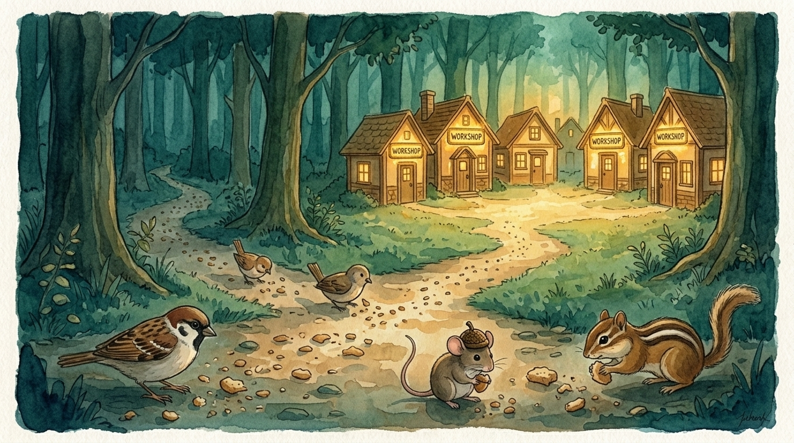
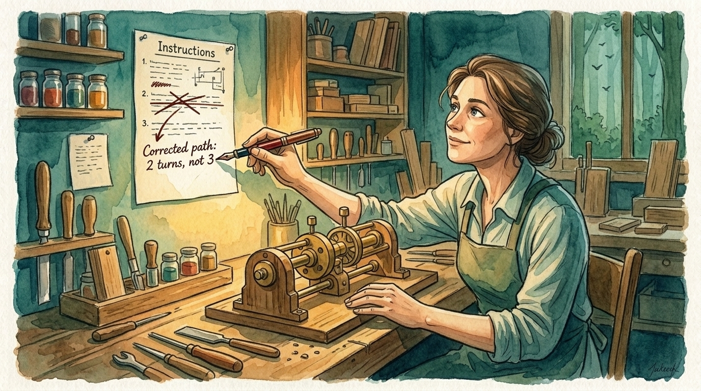

# Claude Workforce

*A skill tells an AI what to do. An employee knows what to do, refuses to do anything else, and can prove it did the job.*

> **Supersedes** [claude-enforcer](https://github.com/odysseyalive/claude-enforcer). If you run the enforcer today, [here's the migration path](#coming-from-claude-enforcer).

> **PAIRS WELL WITH:** playwright-mcp. Nobody here is hired without a way to prove the work is right, and the employees who deal with websites are the hardest to hire, because clicking around a web page rarely leaves behind a clean pass-or-fail signal the way finished code does. This tool records you logging into a site once, then turns that recording into a repeatable test the employee can actually run, so the proof is a test that passes, not a model's say-so. It also handles fetching web pages, which these employees otherwise can't do on their own. [Visit the repo →](https://github.com/odysseyalive/playwright-mcp)

## Contents

- [Not Every Brain Does Every Job](#not-every-brain-does-every-job)
- [How We Got Here](#how-we-got-here)
- [Getting Started](#getting-started)
  - [Install](#install)
    - [Into a specific Claude config directory](#into-a-specific-claude-config-directory)
  - [Updating](#updating)
- [Talking to the Company](#talking-to-the-company)
- [Three Tiers, Measured](#three-tiers-measured)
- [Which Model on Each Tier](#which-model-on-each-tier)
- [Employee Handbooks](#employee-handbooks)
- [A Handbook Isn't Finished Until a Stranger Can Follow It](#a-handbook-isnt-finished-until-a-stranger-can-follow-it)
- [When Something Goes Wrong, the Document Is at Fault](#when-something-goes-wrong-the-document-is-at-fault)
- [Your CLAUDE.md Gets Deleted](#your-claudemd-gets-deleted)
- [The Long Session Is the Expensive One](#the-long-session-is-the-expensive-one)
- [The Honest Parts](#the-honest-parts)
- [If Your Repo Has a Test Corpus](#if-your-repo-has-a-test-corpus)
- [Platform Facts Expire](#platform-facts-expire)
- [Coming from Claude Enforcer](#coming-from-claude-enforcer)
- [Uninstalling](#uninstalling)
- [The Tools That Check the Work](#the-tools-that-check-the-work)
- [Learn More](#learn-more)
- [Personal Project](#personal-project)
- [Standing on Shoulders](#standing-on-shoulders)
  - [People](#people)
- [License](#license)

## Not Every Brain Does Every Job

You've probably switched models three times in one sitting without thinking about it. Nothing was broken; each one was just good at a different thing. The coder untangled a knot in your project without breaking the thing next to it. The writer gave your draft a pulse. Neither could do the other's job.

We spent two years asking which model was best. [The answer turned out to be a routing problem, not a ranking one.](https://odysseyalive.com/focus/two-brains)

The part that surprises people is that the best orchestrator often isn't the most powerful model. A conductor doesn't play louder than the orchestra. They hear how the pieces fit together. A model built for judgment and coordination can run a company of specialists better than a model built to write a million lines of code, because those are different jobs. The writer can't debug. The debugger can't write. Nobody complained.

Claude Workforce turns that insight into a structure. Instead of one assistant doing everything, you get a company: a CEO that routes work to the right desk, leads that coordinate a department, and individual contributors, the workers who actually do the task. Each one runs on the model that fits its job, carries a handbook it follows, stays inside a lane it won't leave, and passes a check (some automatic proof it did the work, like a test that comes back green). So "done" means proven, not just claimed.


*The orchestrator's job is hearing how the others fit together.*

## How We Got Here

This project grew out of [claude-enforcer](https://github.com/odysseyalive/claude-enforcer), which solved a real problem.

Instructions you write at the start of a conversation fade as the conversation grows. Like breadcrumbs in a fairy tale, they get consumed by everything that comes after. Nelson Liu's group at Stanford [measured that and named it "lost in the middle"](https://aclanthology.org/2024.tacl-1.9/). A model retrieves worst from the middle of a long input and best from its edges.

The enforcer built layers to resist that: instructions that were harder to ignore, automatic rules that fired on their own, and checkers that ran in a clean, separate conversation where the clutter of the main chat couldn't reach them. And it worked. The instructions stopped drifting. But the longer the system ran, the clearer a different problem became.

Even a hardened set of instructions has no owner. Nothing stops it from wandering outside its lane. And it has no way to prove it actually did the job. You get a summary at the end and trust that what happened underneath was correct.

The fix wasn't harder rules. It was structure.

**Name the owner.** Now someone is responsible. **Name the scope.** Now they won't wander. **Name the check.** Now they can prove they did the job.

A set of instructions with those three things is an employee. A set of employees is a company you can talk to.


*Instructions left at the start of a conversation get consumed by everything after. Employees don't fade. They have an address.*

## Getting Started

Claude Code v2.1.32 or later. Check with `claude --version`.

### Install

One command. Same command to install, and to update later.

Linux / macOS:
```bash
bash -c "$(curl -fsSL https://raw.githubusercontent.com/odysseyalive/claude-workforce/main/install)"
```

Windows PowerShell:
```powershell
irm https://raw.githubusercontent.com/odysseyalive/claude-workforce/main/install.ps1 | iex
```

It looks in both places workforce can live before it does anything, and acts on what it finds:

| Found | What happens |
|---|---|
| an existing install | it is updated in place, at the path it is already at |
| both a personal and a project copy | **both** are updated, and it tells you which one is shadowing the other |
| nothing | it asks where to put it: personal or project |

That question is the only one, and it only comes up on a first install. Personal puts one copy at
`~/.claude/skills/`, serving every project on this machine, and is the right answer for almost
everyone. Project puts a copy inside this one repo, so it travels with a clone. The reason to pick
it is collaborators, or sessions that only ever see the cloned repo.

With no terminal to ask on (a CI or piped run), it installs personal and says so, rather than
guessing at a repo it may not be sitting in.

To skip the question and force a scope, add `-- --project` or `-- --user` on Linux / macOS, or set
`$env:WORKFORCE_SCOPE='project'` before the PowerShell line.

#### Into a specific Claude config directory

Run more than one Claude environment on one machine (two paid accounts side by side, say, each with
its own `CLAUDE_CONFIG_DIR`), and a personal install needs to land in the *right* one.

On Linux / macOS, name it with `--config-dir`:

```bash
bash -c "$(curl -fsSL https://raw.githubusercontent.com/odysseyalive/claude-workforce/main/install)" -- --config-dir ~/.claude-work
```

On Windows PowerShell, set `WORKFORCE_CONFIG_DIR` before the install line:

```powershell
$env:WORKFORCE_CONFIG_DIR='C:\path\to\.claude-work'; irm https://raw.githubusercontent.com/odysseyalive/claude-workforce/main/install.ps1 | iex
```

Either way it implies a personal install into that directory: the skill, its settings, and the
shipped agents all land under the config root the session resolves from, so the copy is actually
reachable there rather than in a directory Claude never reads. It can't be combined with `--project`.
If your shell already runs under the target environment (`CLAUDE_CONFIG_DIR` set), the standard
install command above lands there on its own. Each **project's** company still lives in that project's
own `.claude/` regardless. The config directory only relocates the personal, cross-project install.

Then restart Claude Code and run your first audit:

```
/workforce audit
```

The audit reads your project (its layout, its tooling, its purpose, its history) and designs the smallest company that can do its work. It asks one question (which models at which tiers) and works out everything else on its own.

It works on empty projects too. Thin evidence means a small roster, which is the right answer for a project that hasn't been built yet. A role whose verification can't be named is reported unstaffed, never hired. **A role with a runnable check is an employee. A role without one is a job title.**

Preview the plan without writing anything. `audit --review`.

### Updating

```
/workforce update
```

Updating replaces the skill wholesale. Nothing you edit lives inside it, so there's no clobber risk.

It syncs and stops; it never inspects your org, so its cost doesn't grow with how much you've
staffed. To check the org against the new release, run `/workforce verify` afterward.

## Talking to the Company

Describe the task. `/org` finds the owner.

```
/org fix the pricing copy on the homepage
```

That goes straight to one IC, the content writer who owns homepage copy.

```
/org the onboarding module needs a rewrite across design and content
```

That goes to a lead, who fans out across the department.

```
/org should we ship the signing module standalone?
```

That goes to the CEO, because it crosses departments and nobody below owns the answer.

```
/org we need someone who can audit accessibility
```

That has no owner, so it goes to HR as a hiring request.

The CEO isn't a funnel. Routing everything through the top would spend one of your three hand-off levels on every single task and leave the people doing the actual work with none left to hand off themselves. `/org` sends the work to the *lowest* desk that can actually handle it. When it's a toss-up, it goes downward.

## Three Tiers, Measured


*Three levels is all you get. The ceiling was measured before any of this was designed.*

Handing work down bottoms out three levels deep. We measured that ceiling with a tiny test probe on a real machine before any of this was designed, rather than trust what the documentation claimed. Your session is the CEO, level one. It hands work to a lead, level two. The lead hands work to an IC, level three. There is no fourth level.

A level past that ceiling doesn't fail loudly. It collapses quietly. The deepest employee loses its ability to hand work down and just does the task itself, while its handbook still says it delegated. The failure reads as success, which is exactly why the limit is enforced rather than politely suggested.

## Which Model on Each Tier

The audit asks one thing it can't infer: which model each kind of agent runs on. It marks a recommendation on every choice, and taking the recommendation is almost always right. What follows is the reasoning behind those marks, so you know the one or two places worth overriding.

Your session is the CEO, and you pick its model yourself with `/model`. The audit never sets it. Put a model here that keeps taking direction, not the flashiest one. This is the seat you talk to all day, the conversation that runs longest, and a model that locks in early on its own reading of the task is the wrong thing to be steering by the afternoon. The best coordinator is the one that still hears you at turn fifty.

The lead runs on the same logic. It plans, hands work out, and reads back what returns, and its early calls are inherited by every IC beneath it. A cheap lead is the expensive place to save.

The IC is where that flips. This is the wide part, where one work order turns into many workers running at once, and every one of them costs money to start up whether or not the job needed a powerful model. So the ICs get the faster, cheaper model, working at a moderate setting. Pushing them harder rarely improves this kind of routine work, and whatever it costs gets multiplied across the whole wave of them. Moving the ICs to a cheaper model is the single biggest thing you can do about your bill.

Writing and design get the model with the best prose and taste, which usually isn't the cheapest one. Code gets the strongest coder; code is read by a machine and executed, so a weak paragraph is edited and a weak patch ships a bug.

The advisor is optional. It sits beside your session as a second opinion and reaches none of the employees, so it carries no effort setting. Leave the field blank and type `none` to skip it, and the setting is removed instead of stored empty.

Two escapes from the four. The blank field on any choice takes a model name you type by hand: the very newest, most capable model for the hardest work, or a small cheap one for the most routine ICs. And none of it is locked in at audit time. `/workforce model-map` reopens every one of these choices later, without re-running the audit.

## Employee Handbooks

Two sources shaped the handbooks, and they disagree.

Boris Cherny, the creator of Claude Code, argues at [Startup School 2026](https://www.ycrootaccess.com/p/boris-cherny-building-claude-code) that modern models need three things and nothing more: the task, the guardrails, and the exit criteria. Over-specifying steps is the failure mode he sees most.

Sam Carpenter, who wrote [*Work the System*](https://www.workthesystem.com), argues the exact opposite. Assume nothing, because the person executing has never seen the job. Write every step. His whole book is built on that premise, and his document hierarchy is the skeleton of this project. A Strategic Objective at the top. Operating principles underneath. Working procedures at the bottom. Every decision conforms to the layer above it, and a case no procedure covers falls upward to the principles rather than getting a new rule written for it. That second half is the part that keeps a company from drowning in documentation about things that happened once.

Both are right, for different readers. A lead reasoning about how to coordinate a department needs latitude. An IC running blind in a brand-new conversation, with no history and nobody to ask, needs every step spelled out. Leads get charters. ICs get numbered procedures.

Every handbook names a check that proves the work: a command that comes back successful, a set of tests that pass, a file that has to exist. *"Review the output for quality"* gets rejected at authoring time, because an employee that can't verify itself either stops early or claims a success it didn't earn.

Web-facing work is the hardest kind to write a real check for. [playwright-mcp](https://github.com/odysseyalive/playwright-mcp) solves it. It records you logging into a site once, then builds a repeatable test out of that recording, with no model involved in the checking. The employee proves its work by running that test and watching it pass. It also does the web-page fetching these employees otherwise can't do on their own.

Some work has no command that can check it. There, the check is a catalog, a written list to grade against. Every project gets two reviewers, one for code quality and one for whether writing reads as genuinely human, each carrying a list of tells and common mistakes. A catalog turns taste into a checklist. *"Does this read as machine-written?"* is subjective. *"Does this trip three or more of these specific tells?"* is close to mechanical.

## A Handbook Isn't Finished Until a Stranger Can Follow It


*If the handbook can't survive a stranger reading it cold, it isn't finished.*

Carpenter calls them "off-the-street people." His release rule is that a procedure isn't finished until someone uninvolved executes it cold and succeeds. Human organizations approximate this badly, because a colleague always knows *something*.

Here it's exact. When Claude spins up a helper in its own separate conversation, that helper starts genuinely blank: no history of the chat, no memory of the discussion that produced the document, nobody to ask. The uninvolved reader is free, and so the test is real rather than aspirational. Every handbook gets run by one of these cold helpers before it goes into service. If that helper has to ask a question, the handbook doesn't ship.

## When Something Goes Wrong, the Document Is at Fault


*When something breaks, the fix goes into the text. Not into a conversation that vanishes tomorrow.*

Two rules, both borrowed, both mechanical here.

**A question is a defect.** When an employee can't answer something from its own handbook, it returns `QUESTION:` and stops. The lead is not allowed to answer it in conversation. Doing that repairs one run and leaves the defect in the text. The next cold reader arrives with no memory of the answer. So the lead files the defect, amends the handbook, and re-dispatches.

**Failure attributes to the document.** Performance records pre-fill the blame as `DOCUMENT`. Blaming the employee means quoting the line that forbade what it did. If you can't quote the line, the verdict reverts. You can only blame the reader if you can point at the sentence.

That isn't manners. Blaming the agent produces no fix. The same handbook in a fresh context produces the same failure tomorrow.

## Your CLAUDE.md Gets Deleted

CLAUDE.md is the file of standing instructions Claude reads at the very start of a session, the house rules for a project. It gets read once, at the head of the conversation, and that placement is the problem. Everything arriving afterward competes with it, so a rule sitting at the top of a long session is a rule that stops applying unnoticed. It is loudest at the start, before any work has happened, and faintest by the time the session is making the decisions that actually matter.

So the audit empties it. Every line of direction moves to whichever piece of the system owns it. A rule about how one employee behaves becomes part of that employee's handbook, which arrives with the employee the moment it's called in. A procedure becomes a skill or a script, loaded at the moment it's used. Anything that has to happen on every single action becomes a hook: a rule that fires automatically, the one kind of instruction that's always awake instead of only being read at the start. Routing rules and whatever fits nowhere else go into the dispatch process that runs on every request. Blocks you marked as your own untouchable words get copied out exactly, character for character, before anything else moves.

Architecture notes and stack descriptions go nowhere, because they are already derivable. A directory listing or a restated build command can be read off the repository on demand, and copying one into a handbook only creates a second copy to keep current.

Then the file is deleted.

The safety here is mechanical. `wf-claude-md --evacuate` reports every directive line as either relocated or UNPLACED, and the deletion refuses while a single line is unplaced or a single immutable block is still sitting in the file. A line that arrived nowhere was not moved, it was lost, and preservation is the first directive this project has. Of the three real projects it has run against, two refuse today, at 70 and 191 unplaced lines. That is what those repositories currently look like, and the refusal is the tool working. An evacuation is finished when the lines have moved, not when the file is gone.

The third is this repository, which ran the audit on itself on 2026-08-06. Its own CLAUDE.md is gone: 83 directive lines proven relocated first, the whole 168-line file stored in `.claude/workforce/.settings-owned.json` before the delete, and in git history besides. The Non-negotiables that had sat at the top of that file are now the `## Guardrails` of the one employee they constrain, and arrive with the employee that has to obey them. The stack description moved nowhere and was dropped.

Emptying the file also turned up a rule that had no other home. A dated, attributed user directive, *a detector ships with its fix*, existed only in CLAUDE.md, and the shipped references carried a paraphrase of it and nothing more. No gate could have caught that, because every gate counts directives wrapped in immutable spans and this one never was. It survived exactly as long as someone kept reading the top of the file. That is the failure the deletion is for: a file can be the only place a rule lives while steadily losing the attention that makes it a rule.

One caveat, since the rest of this reads as a pitch. That instructions at the very start lose their grip as a session grows is a reason, not a measurement. Nothing here has measured it on an actual machine, and this project's own rule is that an unmeasured fact never becomes a check that can refuse your work. What is enforced is the paper trail (that every line moved somewhere), which is a property of files and can be verified.

## The Long Session Is the Expensive One

The last section was about the head of a conversation losing influence. This is about the tail of it getting too big.

A model keeps no memory of its own, so every single turn the whole conversation so far gets sent back to it from scratch. A ten-step job doesn't cost ten times one step; it costs the running total of a history that keeps growing the entire way, so the price climbs faster and faster: every step costs more than the one before it. There's a discount for material that repeats, but it only softens the climb. And a long conversation doesn't only cost more, it reasons worse, because the one thing the model needs is buried in more and more that it doesn't. The long session is both the expensive one and the distracted one.


*A session carries its whole history, and the longer it runs the deeper the one note that matters is buried. A fresh context is the clean bench.*

Most of the company already fights this without trying. An IC works in its own short, separate conversation and hands back a verdict, so four small conversations do the work one long one would have, and four small climbing curves cost less than one big one. The separation was built for the chain of command. The savings came free.

What separation doesn't catch is a single agent spinning its wheels: reading the same file a third time, re-running the command that already failed, thrashing in a way that piles up history without moving the work. `wf-loop-guard` is one of those always-on rules that watches for exactly that: the same action, the same inputs, three times over, with nothing changed in between. When it fires it doesn't scold. It asks the agent to say what it's trying to find, why the last attempts didn't find it, and to try a different approach or hand the problem to someone who hasn't been staring at it. A stuck agent reviewing its own stuck context is the worst-placed judge there is; the useful second look comes from a different reader, which is why the audit's panels are built to disagree.

You can measure how long your own agents run. `wf-runlength` reads a project's saved conversations and reports the spread. Against this repository, the median background helper peaks around 67,000 tokens of history, and the median main session around 227,000, already more than a small model can hold in mind at once, with the longest sessions near a million. A token is about three-quarters of a word. It's what the model reads, and what you're billed for. That is what the problem looks like on a real project.

Three caveats. Claude Code won't tell the guard how full a conversation has gotten, so the guard watches behavior, not size: it catches loops. It can't see a large-but-productive session, and that healthy-but-huge conversation is the part no automatic check can save. The rising cost is plain arithmetic and certain; that a long conversation reasons worse is documented elsewhere and not measured here, so nothing in this project refuses your work on its basis. And the guard ships switched off. Wiring it changes how every agent behaves, so it's a step you take deliberately, the day you decide you want it.

## The Honest Parts

Four things, stated without cushioning.

**The chain of command is advisory.** An employee *can* quietly call in a coworker its handbook says it shouldn't, and the system finds out afterward rather than stopping it in the act. Nothing in this project describes that as enforced.

**The total number of helpers a session can start is capped, and can't be raised.** Limits on how wide a department gets help. Sending work to the lowest desk that can handle it helps. The cap itself is only a warning line, not a wall.

**Only the top-level summary returns to you.** Every employee writes its full work to a file and hands back a verdict plus a pointer to it. A lead that glosses over its team's findings isn't something the system can prevent.

**Cost grows with how many helpers you run.** Every helper you start pays for its own fresh conversation, plus whatever Claude Code automatically loads into it, and there's no way to opt a single helper out. That is why `CLAUDE.md` gets emptied and deleted rather than just trimmed. Until that's done, every line still in the file is paid for on every helper you start, multiplied across the whole company.

## If Your Repo Has a Test Corpus

The audit surveys every markdown file under your project. If some of those files are **deliberately
malformed test fixtures** (a corpus you built precisely so some tool could detect breakage), the
survey will report your fixtures as real problems, and it may treat text inside them as your own
words.

Declare them in a **`.censusignore`** at your project root, one glob per line, `#` for comments:

```gitignore
# deliberately malformed trees; not project content
fixtures/
testdata/broken-*
```

Two things it deliberately does **not** do. It never guesses: there is no `fixtures/` default and no
inference from directory names, so a project that declares nothing has everything surveyed, which is
the normal case. And it never hides what it skipped: every run prints how many files were excluded by
how many patterns, lists them, and **names any pattern that matched nothing**, because a pattern
matching nothing looks like coverage and provides none.

*This was found by running the tool against its own repository, where both reported "sweep hazards"
turned out to be fixtures built to be broken, and half the files carrying user directives were test
data.*

## Platform Facts Expire

Before a line of this system was written, a small test probe checked two behaviors the documentation claimed, on a real machine. One held. The other didn't. And the false one had already been built into a check that would have refused perfectly valid work.

Facts about the platform carry the version of Claude Code they were measured on. After an update they go stale. A stale fact isn't allowed to be the basis of any check that refuses your work.

```
/workforce verify
```

That reports which copy of the skill is active, whether the platform facts are still current, whether the company saved on disk matches the org chart, and whether anything has been written but isn't actually live yet.

## Coming from Claude Enforcer

[claude-enforcer](https://github.com/odysseyalive/claude-enforcer) came first. This project is where that work went.

If you run the enforcer today, install this and run `/workforce audit`. It reads your existing skills, converts the ones that encode one actor's job, and leaves the rest alone. Nothing is deleted without a backup, and `disband` reverses the whole thing.

One honest caveat. The enforcer has run hundreds of times across many projects. This has run fewer. It's the better design and the less proven system, and those aren't the same thing.

See [COMMANDS.md](COMMANDS.md) for the full migration reference.

## Uninstalling

Two ways out. `disband` replays the audit journal, restoring converted skills and removing handbooks. `restore baseline` overwrites the tree from a backup.

```
/workforce disband --execute
```

```
/workforce restore baseline --execute
```

If the skill is gone and you can't run the command, the restore kit inside `.claude-backups/` works on its own. See [COMMANDS.md § Recovery](COMMANDS.md) for the full reference.

## The Tools That Check the Work

Agents write most of what's in this project: the handbooks, the references, the scripts, this page. So the work gets checked against a written catalog anyone can point at, instead of against somebody's taste. Three evaluators do that, and each has its own catalog.

**text-eval reads prose the way an editor hunting for a robot would.** It looks for the tells that give away machine writing: the em-dash leaned on as a crutch, the "it's not X, it's Y" reasoning models reach for, a sentence built like a paragraph when a person would just say it. One tell is only a word choice. It flags a passage when several cluster together. The whole catalog is here, and every rule comes with a test you can hold it to: [text-tells.md](workforce/references/catalogs/text/text-tells.md).

**code-evaluator does the same for the shipped scripts.** Its catalog is a list of the ways code goes wrong: mistakes that repeat, checks that get skipped, the small traps a reviewer learns to watch for. It's split across a [mistake taxonomy](workforce/references/catalogs/code/mistake-taxonomy.md), [cross-file consistency](workforce/references/catalogs/code/cross-file-detection.md), [guards](workforce/references/catalogs/code/guards.md), and [gotchas](workforce/references/catalogs/code/gotchas.md).

**security-evaluator reads the same code for a different kind of danger.** code-evaluator asks whether the code is clean; this one asks whether it's safe to put on the web: a query built by pasting a request straight into it, a password hard-coded where every reader of the repo can see it, a redirect that trusts whatever address it's handed. Its catalog is the OWASP Top 10 written out as signals you can grep for, one per flaw and tagged by language, so a change only pulls in the checks its own code could trip. The catalog can be exhaustive that way without every review carrying all of it. Where a real scanner like semgrep is installed, that's the verdict; where it isn't, the catalog flags candidates and says plainly what a static read can't prove. It's [security-taxonomy.md](workforce/references/catalogs/security/security-taxonomy.md), an [analyzer map](workforce/references/catalogs/security/native-tool-map.md), and [guards](workforce/references/catalogs/security/guards.md).

You never turn these on. The audit wires them in on its own, one evaluator for each department whose work a catalog covers, so prose goes to the writers and code to the script authors. The catalog installs as a skill anyone can check their own work against, and the review is a step the lead runs before the work is called done. How that gets decided is written up in [evaluators.md](workforce/references/evaluators.md).

One last thing, because it's the point. A rule only counts here if something makes it true. Every entry in these catalogs carries a test, and the structural ones sit behind a check that goes red the moment the rule is broken. A rule can't fall out of force without somebody's build failing.

## Learn More

- [Two Brains: Why Dynamic Model Routing Beats Picking One AI](https://odysseyalive.com/focus/two-brains). The routing insight underneath this project, and why "which model is best?" turns out to be the wrong question.
- [Context Is the Interface](https://odysseyalive.com/focus/context-is-the-interface). Why what you show a model before you speak matters more than what you say.
- [Your AI Has Amnesia](https://odysseyalive.com/focus/your-ai-has-amnesia). Why assistants forget instructions, and why a cold reader can test a handbook its author can't.
- [Mrinank Sharma, Please Come Back to Work](https://odysseyalive.com/focus/mrinank-sharma-please-come-back-to-work). Why adversarial agents outperform consensus, and why the audit's panels are built to disagree.
- [Boris Cherny: Building Claude Code](https://www.ycrootaccess.com/p/boris-cherny-building-claude-code). Startup School 2026. Where the task-guardrails-exit-criteria shape comes from, and why Cherny says to delete 80% of your system prompt with every new model.

## Personal Project

This is a personal tool, built for my own projects and shared in case it's useful. It isn't affiliated with or endorsed by Anthropic.

It edits your `.claude/` directory, converts skills, and writes agent definitions, so take the backup when the audit offers it.

Issues and pull requests are welcome. I can't promise a response time.

## Standing on Shoulders

This project has two intellectual parents, and they disagree on almost everything.

**Sam Carpenter** wrote [*Work the System*](https://www.workthesystem.com), and the document hierarchy that holds this project together (Strategic Objective, operating principles, working procedures) is his. So is the conviction that a procedure must be written for someone who has never seen the job, and that the document is at fault when work goes wrong. Carpenter ran a telephone answering service in Bend, Oregon for twenty-seven years. He transformed it from chaos into a machine that churned out thousands of dollars of profits while he worked two hours a week instead of eighty. He did it by writing down every process, assuming nothing, and treating every failure as a defect in the documentation rather than a defect in the person. That idea, that if you can't quote the line you can't blame the reader, is the foundation of every employee handbook in this system.

**Boris Cherny** built [Claude Code](https://docs.anthropic.com/en/docs/claude-code), and his argument runs the other direction: modern models need the task, the guardrails, and the exit criteria. Nothing more. Over-specifying steps is how experienced engineers hobble models that are already smarter than the instructions they're being given. At Startup School 2026, he said to delete 80% of your system prompt with every new model generation, because most of it is compensating for weaknesses the model no longer has.

Both are right. Carpenter is right for workers executing cold, with no history and nobody to ask. Cherny is right for coordinators reasoning about how to get something done. That disagreement settled the shape of the handbooks. ICs get procedures, leads get charters, and neither side had to win.

### People

Special thanks to **Joe Loudermilk**, who helped me understand why giving an LLM a second opinion opens doors. That conversation started everything the agent system became. There is a direct line from that moment to the adversarial panels the audit runs today.

Special thanks to **Wouter Dieters**, who helped me connect organizational theory to agency. An agent behaves differently once it has a role, a scope it won't leave, a check to pass, and someone it answers to. That observation is the design.

Thanks to **Sjoerd Tiemensma**, who convinced me to toss CLAUDE.md in favor of more agency. That nudge cleared the path for agents to own their own context instead of inheriting a shared script, which turned out to be the whole point.

Thanks to **Jeff Polack**, who pointed out that this should support a personal install. That turned out to reshape the whole design, because it meant the skill holds no project state at all and the company lives entirely in `.claude/`.

Thanks to **Goda Go**, who never stops saying *save everything*. That got me curious about how a model actually stores what it learns and finds it again, and that curiosity turned into the way this project keeps records. Every kind of data the company holds has a home and someone who owns it. If a record is missing or looks wrong, you go redo the work to be sure. You never write down a guess. Save a fix once and it's still there next session, so nobody solves the same problem twice.

Thanks also to [**Autonomee**](https://www.skool.com/autonomee/about?ref=ab20c334980842ac864a041f7c84f88c) for hooking together some of the sharpest minds in the business. Several of the ideas in this project crystallized in conversations that wouldn't have happened without that community.

## License

MIT. See [LICENSE](LICENSE).
