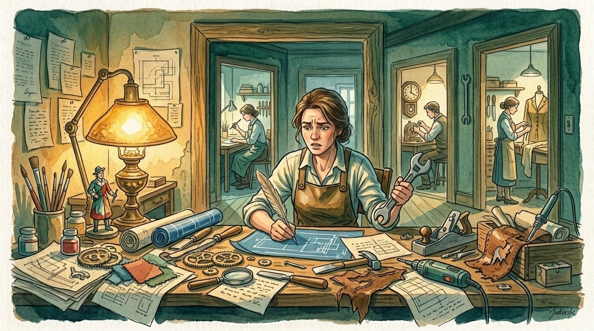
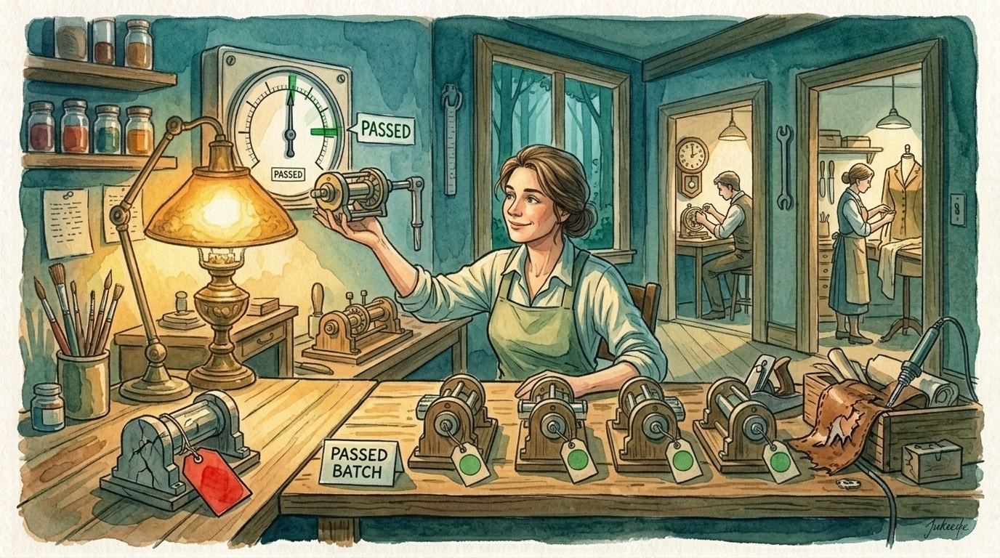

# Claude Workforce

*A skill tells an AI what to do. An employee knows what to do, refuses to do anything else, and can prove it did the job.*

You use one AI assistant for everything. It writes the copy, debugs the build, reviews the design. It does all of it, and none of it well enough. You've probably noticed already: you switch models in the middle of a session without thinking about it, because the coder can't write and the writer can't debug.

Claude Workforce turns that instinct into a company. One command reads your project, picks the right model for each kind of work, writes a handbook for every role, and gives you a team you talk to instead of a single assistant. Each employee follows a scope it won't leave, runs on the model built for its job, and proves its work with a check that actually passes or fails. Not "looks good." Passes or fails.

> **Supersedes** [claude-enforcer](https://github.com/odysseyalive/claude-enforcer). If you run the enforcer today, [here's the migration path](COMMANDS.md).

> **PAIRS WELL WITH:** [playwright-mcp](https://github.com/odysseyalive/playwright-mcp). Web-facing employees are the hardest to hire, because clicking around a page rarely leaves behind a clean pass-or-fail signal the way finished code does. This tool records you logging into a site once, then turns that recording into a repeatable test the employee can run, so the proof is a test that passes, not a model's say-so. It also handles fetching web pages, which these employees otherwise can't do on their own.


## Contents

- [Install](#install)
- [Quick Start](#quick-start)
- [Why This Exists](#why-this-exists)
- [The Full Theory](#the-full-theory)
- [Standing on Shoulders](#standing-on-shoulders)
- [Personal Project](#personal-project)
- [License](#license)

## Install

One command. Same command to install, and to update later.

Linux / macOS:
```bash
bash -c "$(curl -fsSL https://raw.githubusercontent.com/odysseyalive/claude-workforce/main/install)"
```

Windows PowerShell:
```powershell
irm https://raw.githubusercontent.com/odysseyalive/claude-workforce/main/install.ps1 | iex
```

First install asks one question: personal or project scope. Personal puts one copy at `~/.claude/skills/` and serves every project on this machine. That's the right answer for almost everyone. Project puts a copy inside the repo so it travels with a clone.

Then restart Claude Code and run your first audit:

```
/workforce audit
```

The audit reads your project, its layout, its tooling, its purpose, and designs the smallest company that can do its work. It asks one question (which models at which tiers) and works out everything else on its own. Preview without writing anything: `audit --review`.

Update anytime with `/workforce update`. Full command reference in [COMMANDS.md](COMMANDS.md).

## Quick Start

Describe the task in plain language. `/org` reads the org chart and hands the work to the lowest desk that can do it. You don't name an employee or pick a tier. You say what you need.

```
/org fix the pricing copy on the homepage
```

Straight to the content writer. Comes back with its check run.

```
/org the onboarding module needs a rewrite across design and content
```

Goes to a lead, because it crosses two people's work and someone has to coordinate them.

```
/org ship the pricing page redesign end to end
```

The whole company on a single job. Design, content, engineering. Each proves its slice before anything ships.

### Hiring

```
/org we need someone who can audit accessibility
```

No one owns that job yet, so it becomes a hiring request. HR researches the industry standard for the role before writing the handbook, so the new employee is held to the bar the field actually expects, not a title invented on the spot.

```
/org the blog posts keep coming out in the wrong voice
```

That looks like a new hire and usually isn't. The content writer already owns voice, so the fix is to amend its handbook rather than hire a second writer beside it. The company extends before it hires.

### Quick answers and pushback

```
/org who owns the checkout flow?
```

Spins up nobody. The answer is already sitting in the org chart, so the company reads it back. No agent started, no cost spent.

```
/org have the copywriter also fix the failing checkout test
```

The copywriter won't take this. Patching a test is engineering's work, outside its lane, so it hands an escalation back to its manager. The refusal is the point. An employee that quietly does work it was never scoped for is an employee whose lane means nothing.

More examples and the reasoning behind each rule are in [DOCTRINE.md](DOCTRINE.md).

## Why This Exists

### One brain can't do every job


*One worker doing every trade at once. Through the doorways, specialists who each do one thing well.*

You ask your AI assistant to write homepage copy, then debug the checkout flow, then review a design comp. It does all three. The copy reads like a machine wrote it because the model that was running is built to write code, not sentences. The design review says "looks good" when the hero image is missing because a code model doesn't know what to look for in a layout. And the debug takes three passes because it's running on a model optimized for prose.

That isn't a broken tool. That's one employee being asked to do marketing, engineering, and QA at the same time. Nobody is good at all three of those things.

### Different brains for different work

We spent two years asking which model was best. [The answer turned out to be a routing problem, not a ranking one.](https://odysseyalive.com/focus/two-brains) The model that writes the strongest prose can't debug a callback. The one that untangles code can't write a sentence a person would say out loud. They are specialties, the same way a surgeon and a plumber both do excellent work and neither can do the other's job.

You already knew this. You switch models by feel. That instinct is right. But managing it by hand means remembering which model is good at what, swapping at the right moment, and hoping you don't forget.

### Instructions fade, structure doesn't

There is a second problem, and it compounds the first. Instructions you give at the start of a conversation lose their grip as the conversation grows. Nelson Liu's group at Stanford [measured this](https://aclanthology.org/2024.tacl-1.9/) and named it "lost in the middle." A model retrieves worst from the middle of a long input and best from its edges. So the rules you wrote at the top are loudest before any work has happened, and faintest by the time the session is making the decisions that actually matter.

Managing by hand works until it doesn't, and the failure is invisible. The assistant stops following a rule it was given an hour ago, and you don't notice because it doesn't announce that it forgot.


*Instructions left at the start of a conversation get consumed by everything after. Employees don't fade. They have an address.*

### Name an owner, a scope, a check

The fix is structure, borrowed from how real companies already work.

**Name the owner.** Now someone is responsible. **Name the scope.** Now they won't wander into someone else's job. **Name the check.** Now they have to prove they did the work instead of just claiming it.

A set of instructions with those three things is an employee. A set of employees is a company you can talk to. The audit builds that company for your project: a CEO (your session), leads that coordinate departments, and individual contributors that do the actual work. Each runs on the model built for its job. Each follows a handbook. Each stays inside a lane.

### "Done" means proven


*The gauge doesn't care who built it. It passes or it doesn't.*

This is the part that separates the system from a prompt template. Every employee names something that proves the work is finished: a command that returns successful, a set of tests that pass, a file that has to exist. Work that can't be checked by a command gets checked against a written catalog, a list of specific tells a reviewer grades against. *"Does this read as machine-written?"* is a matter of opinion. *"Does this trip three of these twelve specific tells?"* is close to mechanical.

No employee is allowed to call the job finished without its check clearing. A role whose check can't be named gets reported as unstaffed, not quietly hired with no bar to clear. An honest "not proven yet" beats a department that rubber-stamps itself.

### The tunnel nobody sees from inside


*The focused worker can't see the crack in the wall. The person outside can't miss it.*

Putting the right model on the right job solves the routing problem. It does not solve a second one: a model that is deep in a task locks onto its reading of the situation and stops questioning it. The more powerful the model, the worse this gets. A model built for careful reasoning will reason carefully about the wrong thing and never notice. It feels like thoroughness from inside, which is exactly why noticing does not work.

This is not a guess. Kumaran et al. [measured it](https://www.nature.com/articles/s42256-026-01217-9) and published in *Nature Machine Intelligence* (2026): when an LLM can see its own prior answer, its willingness to change drops by 71%, and its confidence in that answer rises, even with no new information. They call it choice-supportive bias. It showed up in every model they tested. Separately, Sharma et al. at Anthropic [documented](https://arxiv.org/abs/2310.13548) that models consistently tell users what they want to hear rather than what is true, a behavior they named sycophancy. And Jhaveri et al. [showed](https://arxiv.org/abs/2604.02485) that LLMs exhibit confirmation bias in hypothesis exploration: they propose evidence to confirm rather than to challenge. Together, a model that sticks with its first reading, agrees with the person talking to it, and seeks confirming evidence is a model that can walk confidently in the wrong direction.

We measured it too, on this project. Ten tunnels, ten wrong readings that felt right at the time. Nine of the ten escapes came from outside the turn that formed the reading. Six from the user, three from a spawned reader running in its own separate context. Zero came from the model noticing on its own. So the fix is never "look again." It is "ask someone who hasn't been looking."

That is what the widening mechanism does. Before a turn starts, a small classifier tags the ask by what kind of evidence would settle it: a question about how something behaves needs the thing to be run. A question about whether something exists needs a directory listing, not a confident assertion. When the turn finishes, a check looks at whether that kind of evidence was actually gathered. If it wasn't, an independent reader is spawned: fresh context, no history, none of the reasoning that built the tunnel. That reader looks at what the turn concluded and what the repository actually says, and reports what it found. It never edits. The finding is the whole deliverable.

The reader doesn't need to be right every time. A gate needs accuracy, because a wrong gate blocks good work. This is not a gate. It is a perspective, and a perspective that sends you to look at something you were not looking at has already done its job, even when its own conclusion turns out to be wrong. Every finding this mechanism has surfaced came from reading two things together that the original turn had only ever read apart.

## The Full Theory

Everything behind these ideas is written out in [DOCTRINE.md](DOCTRINE.md): the document hierarchy borrowed from Sam Carpenter's *Work the System*, the minimal instruction shape Boris Cherny argues modern models need, the measurement that set the three-tier ceiling before a line of code was written, the evaluators that grade against a written catalog instead of taste, and the honest parts stated without cushioning.

If you want to understand why handbooks are written for someone who has never seen the job, why the long session is the expensive one, or why your CLAUDE.md gets deleted and where every line goes, that is the document. The theory and the design decisions live there. This README is the front door.

### Further Reading

- [Two Brains: Why Dynamic Model Routing Beats Picking One AI](https://odysseyalive.com/focus/two-brains). The routing insight underneath this project.
- [Context Is the Interface](https://odysseyalive.com/focus/context-is-the-interface). Why what you show a model before you speak matters more than what you say.
- [Your AI Has Amnesia](https://odysseyalive.com/focus/your-ai-has-amnesia). Why assistants forget instructions, and why a cold reader can test a handbook its author can't.

## Standing on Shoulders

This project has two intellectual parents, and they disagree on almost everything.

**Sam Carpenter** wrote [*Work the System*](https://www.workthesystem.com), and the document hierarchy holding this project together is his: Strategic Objective at the top, operating principles underneath, working procedures at the bottom. Every decision conforms to the layer above it. So is his conviction that a procedure must be written for someone who has never seen the job, and that when work goes wrong the document is at fault.

**Boris Cherny** built [Claude Code](https://docs.anthropic.com/en/docs/claude-code), and his argument runs the other direction: modern models need the task, the guardrails, and the exit criteria, nothing more. Over-specifying steps is how experienced engineers hobble models that are already smarter than the instructions they're being given.

Both are right, for different readers. Carpenter is right for workers executing cold, with no history and nobody to ask. Cherny is right for coordinators reasoning about how to get something done. That disagreement settled the shape of the handbooks: ICs get procedures, leads get charters, and neither side had to win.

### People

Special thanks to **Joe Loudermilk**, who helped me understand why giving an LLM a second opinion opens doors. That conversation started everything the agent system became. There is a direct line from that moment to the adversarial panels the audit runs today.

Special thanks to **Wouter Dieters**, who helped me connect organizational theory to agency. An agent behaves differently once it has a role, a scope it won't leave, a check to pass, and someone it answers to. That observation is the design.

Thanks to **Sjoerd Tiemensma**, who convinced me to toss CLAUDE.md in favor of more agency. Thanks to **Jeff Polack**, who pointed out that this should support a personal install. Thanks to **Goda Go**, who never stops saying *save everything*. Thanks also to [**Autonomee**](https://www.skool.com/autonomee/about?ref=ab20c334980842ac864a041f7c84f88c) for hooking together some of the sharpest minds in the business.

## Personal Project

This is a personal tool, built for my own projects and shared in case it's useful. It isn't affiliated with or endorsed by Anthropic.

It edits your `.claude/` directory, converts skills, and writes agent definitions, so take the backup when the audit offers it.

Issues and pull requests are welcome. I can't promise a response time.

## License

MIT. See [LICENSE](LICENSE).
